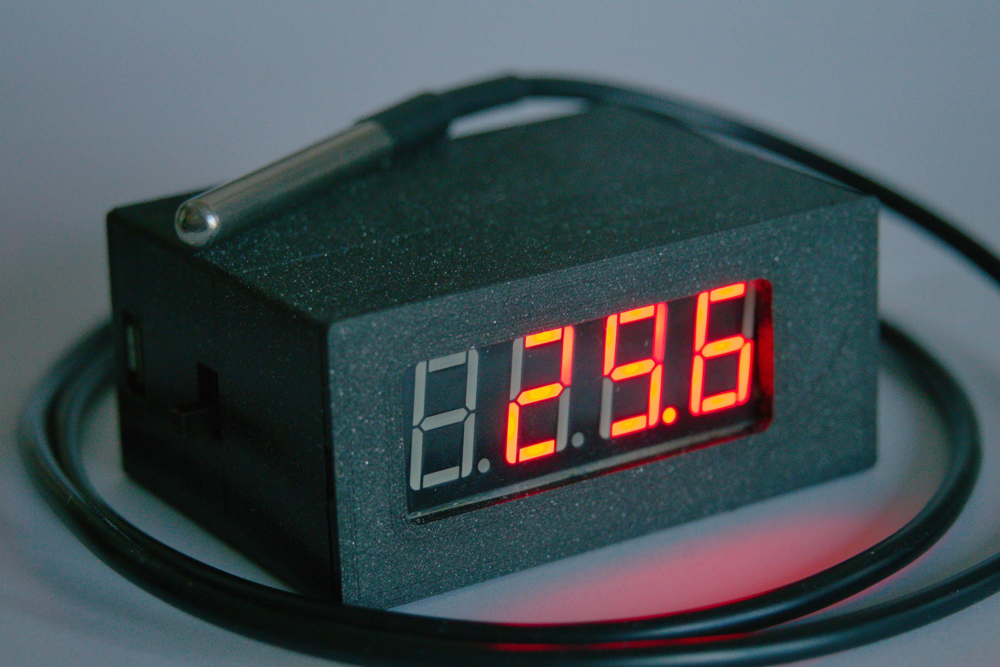
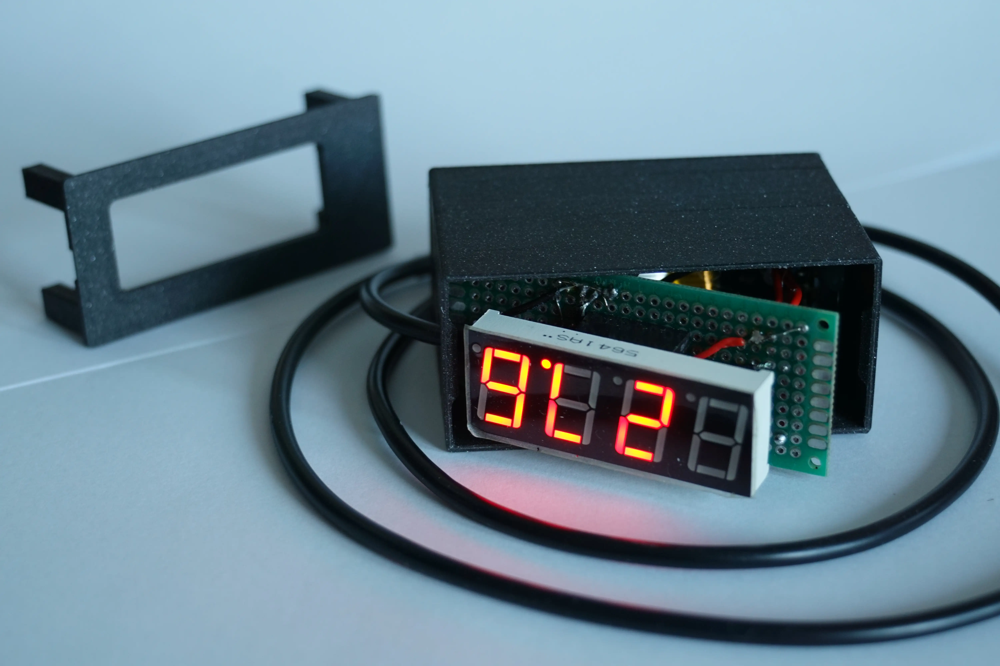

# Atmega328P probe thermometer

Probe thermometer based on Atmega328P microcontroller and DS1820 thermometer.

Functional thermometer with a 4 digit 7 segment display allowing for displaying a wide range of temperatures. 
Thermometer has a probe on a long cable allowing it to be put inside harsh conditions without risking the device 
itself. 

Also contains a battery with a charging circuit and a switch. The case is designed and 3D Printed by me.

* * *
## Picture of the thermometer assembled

* * *
## Picture of the thermometer with the removable top cap off

* * *

## Usage